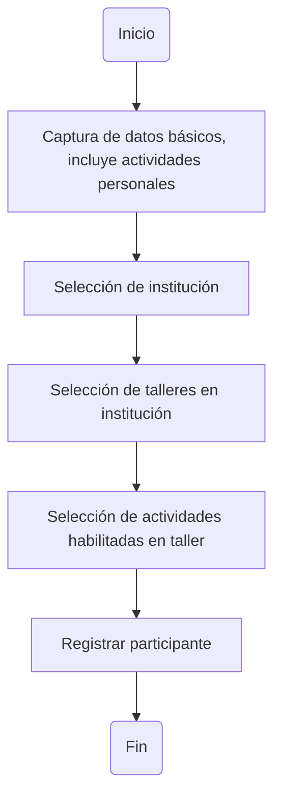

En su orden los endpoints son:

- Get all institutions ([curl](../api_specs/admin_api.md#get-all-institutions))
- Sign up participant ([curl](../api_specs/users_api.md#sign-up-participant))
- Update participant ([curl](../api_specs/members_api.md#update-participant))
- Get workshop execution by institution id ([curl](../api_specs/workshops_api.md#get-execution-by-institution-id))
- Enroll participant ([curl](../api_specs/members_api.md#enroll-participant))

